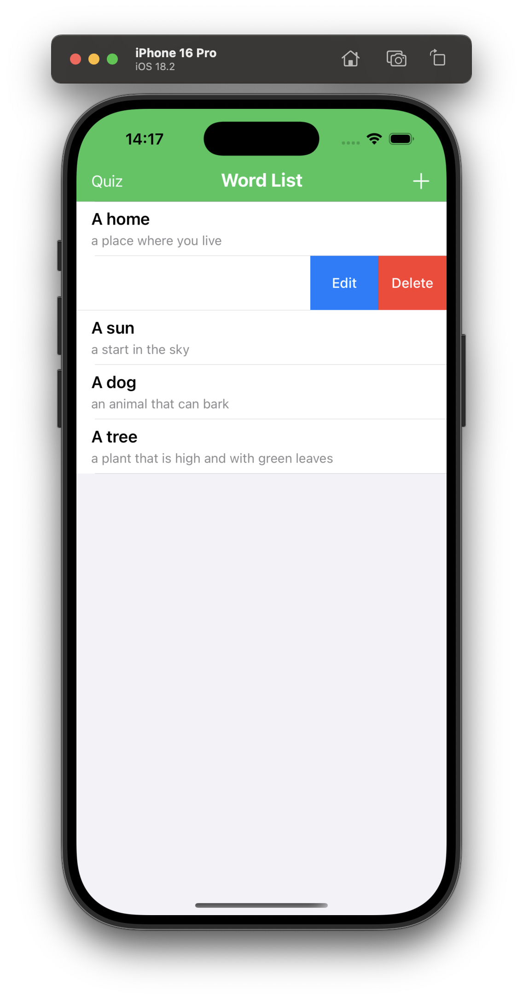

//
//  README.md
//  Wordy
//
//  Created by Kateryna on 02/01/2025.
//

## Features

- **View Word List**: Display all stored words in a table view.  
- **Add New Words**: Use an alert-based form to create entries.  
- **Edit Words**: Either swipe in the table or go to the detail screen to edit.  
- **Delete Words**: Swipe to delete in the table or tap a trash icon on the detail screen.  
- **Quiz Mode**: View a random definition and choose the correct word among distractors.

